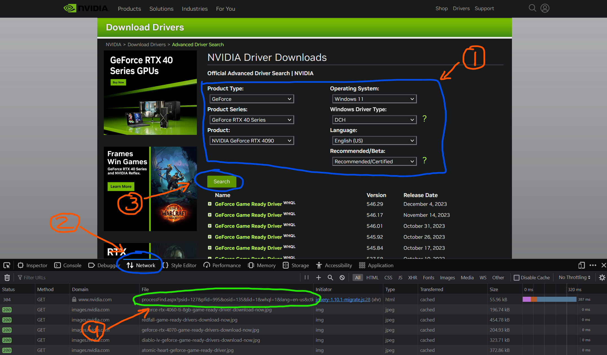

# gpu-update-checker
GPU Update Checker, automatically checks if are any new drivers available for your video card.

Simple and minimalistic java application which stays in your system tray and do the job.

### Some cool facts:
- cross-platformed app, works on windows, macOS, linux
- does not need to be installed, "portable", one file to run
- it's tiny, only 25kb of size
- it does not use much RAM (50mb for my pc with 32gb)
- it does not use much CPU (<1%)
- it does not do anything else except check for new driver version
- simple alternative for Nvidia GeForce Experience which now requires login to use (actually that why I've created this app)

### How to use
1) Make sure you have java installed on your system
1) Go to [releases](https://github.com/kyxap/gpu-update-checker/releases) and download latest version available
1) Unzip archive and store application where you want
1) Open folder and edit: `config.properties`
1) You need to change `uri` if you are not using RTX 40 series on windows (default config), to do so:
   - go the nvidia [website](https://www.nvidia.com/Download/Find.aspx?lang=en-us#)
   - select product type, os, language, etc (1)
   - open debug window of your browser (Right mouse click on the page -> inspect)
   - open network tab (2)
   - click `Search` button (3)
   - find first network call and copy `https` url from that request, it starts with `https://www.nvidia.com/Download/*` (4)
1) If you do not want to use debug and dev output update to:
   - `dev-output=false` (recommended)
   - `debug=false` (not recommended)
1) Save file
1) Open `*.jar` file
1) Look into your system tray
1) Application will check for updates on start and every hour
1) Use right click to open context window for extra
1) Consider to add it to auto start with your system
1) Enjoy!

<details>
<summary>Click for screenshot with details on how to get uri</summary>

#### Visualized steps to get URL for your specific needs

</details>

### Working uri, just in case:
1) RTX 40 Series Win - `https://www.nvidia.com/Download/processFind.aspx?psid=127&pfid=995&osid=135&lid=1&whql=1&lang=en-us&ctk=0&qnfslb=00&dtcid=1`
2) RTX 30 Series Win - `https://www.nvidia.com/Download/processFind.aspx?psid=120&pfid=985&osid=135&lid=1&whql=&lang=en-us&ctk=0&qnfslb=00&dtcid=1`

### Debug logging
If debug is enabled `debug.log` will be created in same folder, usefully for application analyzing or debugging, file example:
```logcatfilter
[2023-12-06 21:24:56] URI which will be using to parse data from: https://www.nvidia.com/Download/processFind.aspx?psid=127&pfid=995&osid=135&lid=1&whql=1&lang=en-us&ctk=0&qnfslb=00&dtcid=1
[2023-12-06 21:24:57] Scheduler executing started for every: 60 minutes
[2023-12-06 21:24:57] Latest extracted version from html: 546.29
[2023-12-06 21:24:57] Installed version 546.29
[2023-12-06 21:24:57] Needs update: false
```

### Questions, issues, requests? 
If any, please create new issue [here](https://github.com/kyxap/gpu-update-checker/issues)
